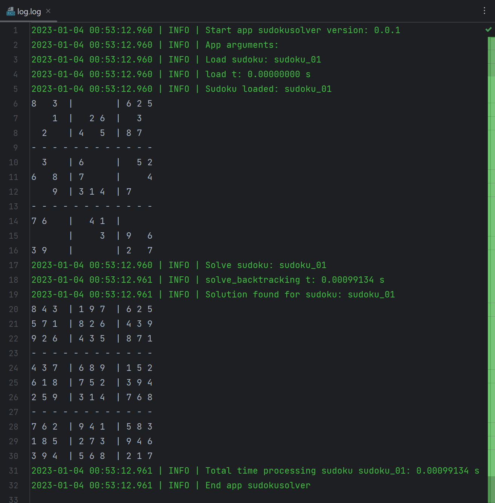

## Sudoku Solver

	Solves sudokus of 9x9 cells with 9 box cells of 3 cells each one.

	version: 0.0.1
	author: Joan A. Pinol
	author_nickname: japinol
	author_gitHub: japinol7
	author_twitter: @japinol
	Python requires: 3.12 or greater.

## Usage

	 sudokusolver [-h] [-n NAME] [-l] [-m] [-p] [-pd] [-t]

	optional arguments:
	  -h, --help            show this help message and exit
	  -n NAME, --name NAME  the sudoku's name.
	  -l, --multiplelogfiles
	  -m, --stdoutlog       Print logs to the console along with 
                            writing them to the log file
	  -p, --nologdatetime   Logs will not print a datetime
	  -pd, --processinputdir
                            solve all sudokus from the input directory.
	  -t, --debugtraces     Show debug back traces information when 
                            something goes wrong

**Default optional arguments**

	name 	            sudoku_01
	multiplelogfiles    False
	stdoutlog           False
	nologdatetime       False
	processinputdir     False
	debugtraces         False

**Example of output when solving a sudoku from the command line**

  

**Examples of usage**

    > Solves sudoku with name sudoku_01 from the input directory:
       $ python -m sudokusolver
    > Solves sudoku with name sudoku_02 from the input directory:
       $ python -m sudokusolver --name sudoku_02
    > Solves all sudokus from the input directory:
       $ python -m sudokusolver --processinputdir

**To make The Sudoku Solver work**

	Do this:
	    1. Clone this repository in your local system.
	    2. Go to its folder in your system.
	    3. $ pip install -r requirements.txt
	    4. $ python -m sudokusolver
